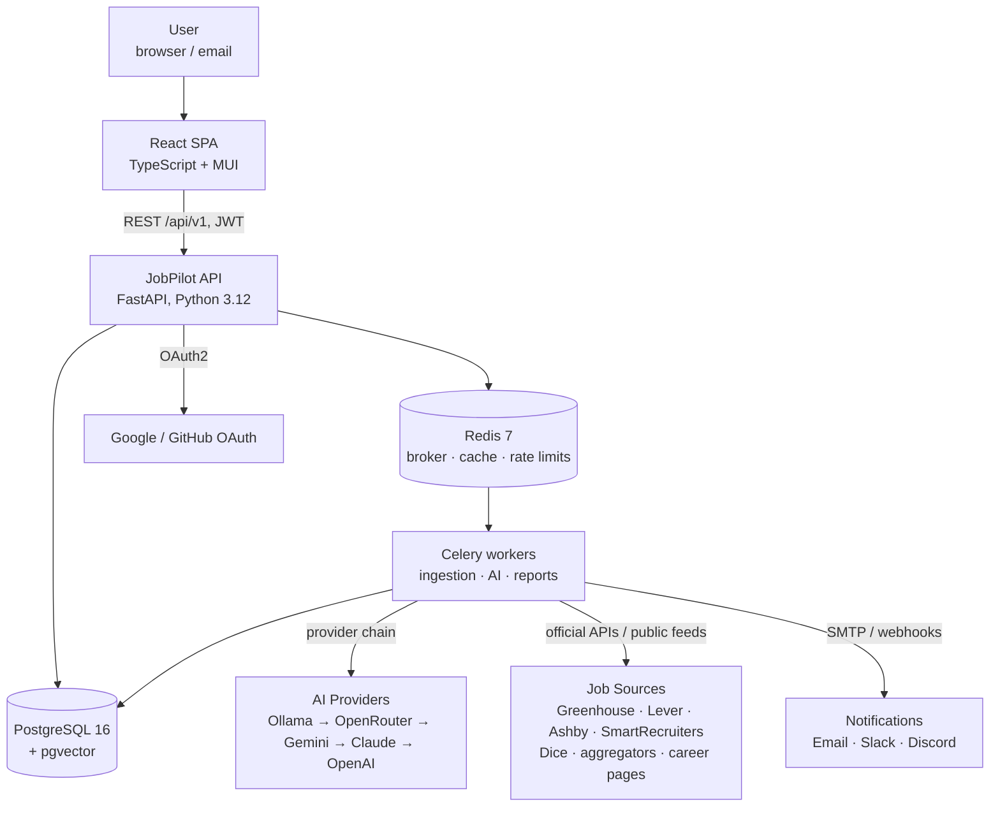
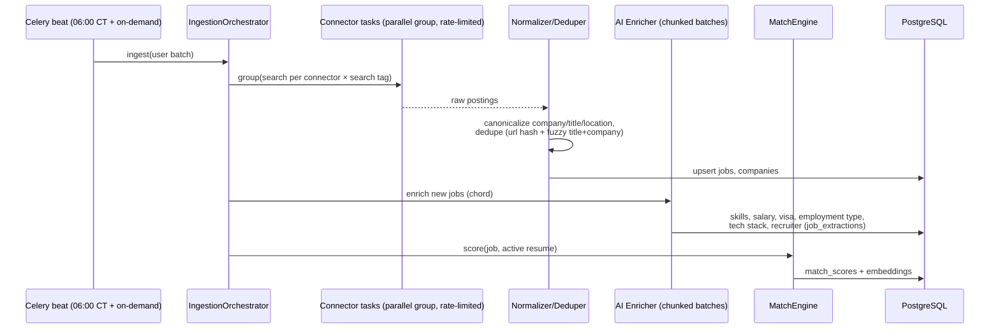
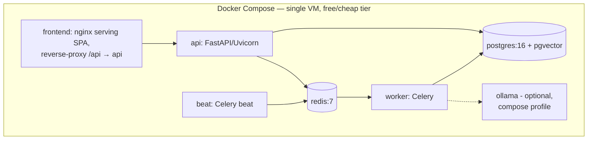

# JobPilot Platform — System Architecture

**Version:** 1.1 (Phase 1, revised: Python stack approved) · **Status:** Approved
**Stack:** Python 3.12 · FastAPI · SQLAlchemy 2 + Alembic · Celery · PostgreSQL 16 + pgvector · Redis 7 · React 18 + TypeScript + MUI · Docker

> **v1.0 → v1.1:** Backend language changed from Java/Spring Boot to Python/FastAPI
> (owner-approved). Rationale: the platform's core workloads — scraping, LLM/RAG,
> resume document generation — all have Python-native ecosystems (`python-jobspy`,
> Playwright, LLM SDKs, `python-docx`), and proven prototype code is reused directly.
> All architectural decisions (modular monolith, compliance-first connectors,
> AI provider chain, pgvector RAG, security model, schedules) are unchanged.

---

## 1. What we are building

A cloud-hosted, multi-user-ready AI job-search platform that discovers jobs daily,
matches and ranks them against the user's resumes with AI, generates tailored
resumes/cover letters/recruiter messages, tracks every application through an
ATS-style pipeline, reports daily by email, and exposes a RAG-powered chat
assistant ("Jarvis") over the user's own data.

**Design constraints that shape everything below:**

1. **Compliance-first connectors.** No bot-detection evasion, no CAPTCHA
   bypass, no covert human imitation. Each source declares a *compliance mode*;
   automation only where permitted and explicitly user-authorized.
2. **AI is pluggable and optional.** Provider chain Ollama → OpenRouter →
   Gemini → Claude → OpenAI, selected by config. With zero API keys the
   platform still works (local Ollama, plus deterministic fallbacks).
3. **One user today, thousands later.** Single codebase, two process types
   (API + worker) that scale independently; every module boundary is a
   potential service boundary.
4. **Free to run.** Every infrastructure choice has a $0 self-hosted path
   (Postgres, Redis, Ollama, SMTP), no paid SaaS in the critical path.

---

## 2. Architecture style: Modular Monolith, two process types

One Python codebase, deployed as:

- **api** — FastAPI (Uvicorn) serving `/api/v1` + OpenAPI docs.
- **worker** — Celery workers executing ingestion, AI enrichment, generation,
  and notification jobs (Redis broker).
- **beat** — Celery beat, the single cron emitter (schedules stored in DB,
  loaded at start; one beat container ⇒ no distributed-lock complexity, and
  Redis-lock guards make runs idempotent anyway).

Same image for all three; the command differs. This is the Python equivalent of
the "web + worker Spring profiles" plan and keeps the scale-out path identical:
add worker replicas for heavier scraping/AI load, add api replicas behind the
proxy for more users.

Module boundaries are enforced with **import-linter** contracts (the ArchUnit
equivalent): modules may import from another module only via its `api.py`
facade; violations fail CI.

### 2.1 System context (C4 level 1)



### 2.2 Backend modules (C4 level 2/3)

Package layout: `app/<module>/` with `router.py` (FastAPI routes),
`service.py` (use cases), `models.py` (SQLAlchemy), `schemas.py` (Pydantic
DTOs), `api.py` (the only surface other modules may import).

| Module | Responsibility | Key public interfaces |
|---|---|---|
| `common` | Errors (RFC-7807), auditing, encryption, pagination, clock, settings | `AuditLogger`, `SecretCrypto` |
| `auth` | JWT access+refresh, OAuth2 login, password reset, RBAC | `AuthService`, `get_current_user` |
| `user` | Users, roles, preferences (visa/work-auth, locations, remote, FT/contract/W2/1099/C2C, salary, availability) | `UserService`, `PreferenceService` |
| `resume` | Multi-resume storage, parsing (docx/pdf → structured), skills inventory, versioning, chunk embeddings | `ResumeService`, `ResumeParser` |
| `company` | Company + recruiter registry, staffing-firm watchlist | `CompanyService` |
| `connector` | **Connector SPI**, registry, per-source config & compliance gates, rate limiting | `JobSourceConnector`, `ConnectorRegistry` |
| `ingestion` | Celery pipeline: fetch → normalize → dedupe → enrich → score → persist | `IngestionOrchestrator` |
| `ai` | **Provider SPI** + fallback chain, prompt registry, embeddings, token budgets, structured-output parsing | `AiGateway`, `EmbeddingService`, `PromptRepository` |
| `matching` | Hybrid scoring: deterministic + vector similarity + LLM rubric; skill-gap analysis | `MatchEngine` |
| `generation` | Tailored resume (docx), cover letter, recruiter email, LinkedIn message, cold email — truthful-content guardrails | `DocumentGenerator` |
| `application` | ATS-style tracker: 11 statuses, notes, contacts, deadlines, salary; apply strategies | `ApplicationService`, `ApplyStrategy` |
| `assistant` | RAG chat: retrieval over jobs/resumes/applications, tool-calling into other modules, conversation persistence | `AssistantService` |
| `analytics` | Funnel metrics, weekly/company aggregates, distributions, hiring trends, tech demand, response rates | `AnalyticsService` |
| `notification` | Channel SPI (email/Slack/Discord), templated daily & weekly reports (Jinja2) | `NotificationChannel`, `ReportComposer` |
| `scheduler` | Celery beat schedule definitions (CT timezone), run history, admin triggers | `ScheduledJobRunner` |
| `admin` | AI settings, API keys (encrypted), connector toggles, prompt management, logs, users | `AdminService` |

**Layering inside every module** (enforced by import-linter): `router` →
`service` → `models/repositories`. Pydantic schemas are the only objects that
cross the router boundary; SQLAlchemy entities never leave the service layer.
Async SQLAlchemy in the API path; sync sessions inside Celery tasks.

---

## 3. Connector architecture (compliance-first)

### 3.1 The SPI

```python
class JobSourceConnector(Protocol):
    descriptor: ConnectorDescriptor            # id, name, compliance mode, rate limits
    def is_configured(self, cfg: ConnectorConfig) -> bool: ...
    def search(self, query: JobQuery, cfg: ConnectorConfig) -> Iterator[JobPosting]: ...
```

`ConnectorDescriptor.compliance_mode` gates what the platform will do:

| Mode | Meaning | Examples | Auto-apply allowed? |
|---|---|---|---|
| `OFFICIAL_API` | Documented public API | Greenhouse Job Board API, Lever Postings API, Ashby posting API, SmartRecruiters Posting API, Adzuna/Jooble (free keys), USAJobs | Yes, where the API supports it |
| `PUBLIC_FEED` | Public JSON/RSS the site serves to any client | Dice search API, Wellfound/BuiltIn feeds, company sitemap/careers JSON | Prepare-and-link only |
| `SEARCH_LINK` | We construct compliant search URLs; no scraping | LinkedIn, Indeed, Monster, ZipRecruiter (search-only) | No — export for manual apply |
| `USER_AUTHORIZED_AUTOMATION` | Playwright automation on the user's behalf, on sites whose terms permit it, explicit per-site opt-in recorded with timestamp | direct ATS application forms (Greenhouse/Lever hosted pages) | Yes, opt-in, rate-limited, full audit trail |

Rules baked into the framework (not left to each connector):

- Global + per-source **token-bucket rate limiter** (Redis) with polite defaults.
- Honest `User-Agent` identifying the platform; robots.txt respected for any HTML fetch.
- No CAPTCHA solving, no fingerprint spoofing, no headless-detection evasion — if a
  site blocks a request, the job goes to the **manual-apply export queue** instead.
- Per-connector kill switch and config in the admin panel (`connector_settings` table).

### 3.2 Source catalog (initial)

- **ATS platforms (OFFICIAL_API):** Greenhouse, Lever, Ashby, SmartRecruiters —
  structured JSON per company slug. **This is also how most staffing firms are
  covered**: Insight Global, TEKsystems, Apex, Kforce, Randstad, Collabera,
  Diverse Lynx, Pyramid, Compunnel, eTeam, etc. host openings on these ATSs or
  expose public career-site JSON. Staffing firms are seeded as configurable
  `company_watchlist` rows (name + ats_type + slug/careers URL) — adding one is
  a DB row, not code.
- **Dice (PUBLIC_FEED):** public search endpoint (ported from the proven prototype).
- **Aggregators (OFFICIAL_API, free keys):** Adzuna, Jooble; `python-jobspy`
  for boards it supports compliantly — covering Indeed/Monster/ZipRecruiter
  inventory indirectly.
- **LinkedIn/Indeed/Monster/ZipRecruiter (SEARCH_LINK):** deep-link search URL
  builders; matched jobs exportable as CSV / "open in tabs" for manual application.
- **Workday (PUBLIC_FEED per-tenant):** tenant JSON endpoint where publicly
  served; otherwise SEARCH_LINK.
- **Company career pages:** generic `CareersPageConnector` configured per
  company with a JSON path or sitemap pattern.

### 3.3 Ingestion pipeline (Celery canvas)



Tasks are idempotent (natural keys + upserts) and retried with exponential
backoff; enrichment failures degrade to the regex/heuristic extractors ported
from the prototype, so the pipeline never blocks on AI availability.

---

## 4. AI architecture

### 4.1 Provider gateway

```python
class AiProvider(Protocol):
    id: ProviderId                       # OLLAMA, OPENROUTER, GEMINI, ANTHROPIC, OPENAI
    def is_available(self) -> bool: ...  # key present / endpoint reachable (cached in Redis)
    def chat(self, req: ChatRequest) -> ChatResponse: ...   # messages, JSON-schema output
    def embed(self, text: str) -> list[float]: ...          # optional capability
```

`AiGateway` walks the configured priority chain (default: Ollama → OpenRouter
free models → Gemini free tier → Claude → OpenAI) with per-call
timeout/retry/circuit-breaker and per-user daily token budgets. Implementation
detail: providers are wrapped via **LiteLLM** (free, local library) so all five
speak one interface, with structured-output (JSON schema) normalization on top.
Admin panel reorders the chain and stores keys AES-GCM-encrypted. **No provider
available ⇒ deterministic fallbacks** (keyword extraction, template documents) —
the platform never hard-fails on AI.

- **Embeddings:** Ollama `nomic-embed-text` (free) or provider embeddings;
  stored in pgvector (`vector(768)`), model recorded per row to allow migration.
- **Prompt registry:** versioned prompts in DB (`prompts` table), editable in
  admin panel, variables validated against a declared schema. Every AI call
  logs prompt version, provider, latency, and token counts (`ai_invocations`).

### 4.2 AI use-case map

| Use case | Mechanism |
|---|---|
| Resume analysis / scoring / ATS optimization | Structured-output chat + deterministic ATS checks (keyword coverage, section presence) |
| Job extraction | Structured-output chat over JD; heuristic fallback (ported prototype classifiers) |
| Job matching | Hybrid: deterministic sub-scores + cosine(resume_embedding, job_embedding) + LLM rubric with reasoning; all sub-scores persisted so "why ranked low?" is answerable |
| Resume tailoring / cover letters / recruiter & LinkedIn messages / cold email | Generation prompts constrained to facts from the stored resume — **guardrail prompt + post-check: no skill/date/employer may appear that isn't in the source resume** |
| Salary analysis, interview prep, recommendations | Chat over aggregated platform data |
| Assistant (Jarvis) | RAG + tool-calling (below) |

### 4.3 Assistant (RAG + tools)

- **Retrieval:** pgvector similarity over embedded jobs, resume chunks,
  application notes, and conversation memory, filtered by `user_id`, re-ranked
  by recency and match score.
- **Tools (function-calling):** `search_jobs`, `get_top_matches`, `explain_score`,
  `tailor_resume`, `draft_recruiter_email`, `get_weekly_stats`, `update_application_status`.
  Tool schema is provider-agnostic; for non-tool-calling local models the
  gateway falls back to a ReAct-style prompt loop.
- **Conversations** persisted (`ai_conversations`, `ai_messages`) and fed back
  into retrieval → the assistant "learns" from history and outcomes (e.g.,
  which application styles got interviews) via outcome-annotated retrieval.

---

## 5. Security architecture

- **AuthN:** email+password (bcrypt via passlib) and OAuth2 (Google, GitHub —
  Authlib). Stateless JWT (PyJWT): 15-min access token, 14-day rotating refresh
  token stored hashed in DB with reuse detection; logout/blacklist via Redis.
- **Password reset:** single-use, 30-min hashed tokens, email delivery.
- **AuthZ:** RBAC roles `USER`, `ADMIN` (dependency-injected guards); every
  repository query is user-scoped — multi-tenant by `user_id` from day one.
- **Secrets:** user/admin-entered API keys encrypted at rest (AES-256-GCM via
  `cryptography`, master key from env/KMS); masked after write.
- **Audit log:** append-only `audit_events` (who, what, when, ip) for auth
  events, admin changes, automated applications, and outbound messages —
  everything the robot does on your behalf is auditable.
- Standard hardening: CORS allow-list, security headers middleware, Redis
  rate limiting on auth endpoints, Pydantic validation on all DTOs,
  Alembic-managed least-privilege DB user.

---

## 6. Data architecture (full schema: see DATABASE.md, Phase 2)

PostgreSQL 16 with **pgvector** extension (no separate vector DB to run/pay for).

Entity groups (~25 tables, detailed in `DATABASE.md` + `db/schema.sql`):

- **Identity:** `users`, `oauth_accounts`, `refresh_tokens`, `password_reset_tokens`, `audit_events`
- **Profile:** `preferences`, `skills`, `user_skills`, `resumes`, `resume_chunks` (RAG), `notification_settings`
- **Catalog:** `companies`, `recruiters`, `company_watchlist` (staffing firms/ATS slugs), `connector_settings`
- **Jobs:** `jobs` (normalized columns + `raw JSONB`), `job_extractions`, `job_embeddings`, `match_scores`
- **Tracker:** `applications` (11-state enum), `application_events` (status history), `application_contacts`, `generated_documents`
- **AI:** `prompts`, `ai_invocations`, `ai_conversations`, `ai_messages`
- **Ops:** `notifications`, `scheduled_tasks`, `scheduled_runs`, `analytics_snapshots`

Conventions: UUID PKs, `created_at`/`updated_at` everywhere, soft delete only
where history matters (`applications`), partial indexes for hot queries,
HNSW indexes on embeddings.

**Redis usage:** Celery broker + result backend, cache (dashboard aggregates,
provider availability), token buckets (connector + auth rate limits), refresh-token
blacklist. Redis is disposable — nothing durable lives there.

---

## 7. Scheduling & notifications

Celery beat (single instance) emits; workers execute with Redis-lock idempotency
guards. All crons in `America/Chicago`. Every run recorded in `scheduled_runs`
(status, duration, counters) and visible/triggerable in admin.

| When (CT) | Job |
|---|---|
| 06:00 daily | Full ingestion: search → dedupe → enrich → score; queue resume-tailoring recommendations |
| every 2h 08–18 | Incremental ingestion (new postings only) |
| 21:00 daily | Daily report: new jobs, applied, interviews, top-10 matches, AI recommendations → email (+ Slack/Discord if configured); refresh `analytics_snapshots` |
| Sun 18:00 weekly | Weekly analytics, resume-improvement + skill-gap recommendations |

`NotificationChannel` SPI: `EmailChannel` (SMTP + Jinja2 HTML templates),
`SlackChannel`/`DiscordChannel` (incoming webhooks, optional). User-level
notification preferences; all sends logged to `notifications`.

---

## 8. Frontend architecture

React 18 + TypeScript + Vite + MUI v5. Deliberately boring and maintainable:

- **Server state:** TanStack Query (caching, retries, optimistic tracker updates).
  **Client state:** small Zustand store (auth/session, UI prefs). No Redux.
- **API client:** generated from FastAPI's OpenAPI spec (`openapi-typescript`)
  — the contract is enforced at compile time.
- **Routing:** React Router; authenticated layout + `admin` route guard.
- **Pages:** Dashboard · Jobs (filters = the full preference set) · Job detail
  (score breakdown, skill gap, generated docs) · Tracker (kanban by status) ·
  Assistant (chat) · Resumes · Preferences · Admin (providers, keys, connectors,
  prompts, schedules, logs, users).
- Real-time-ish: polling via Query invalidation now; SSE for assistant
  streaming and run progress (FastAPI `StreamingResponse` — no websocket infra).

---

## 9. Deployment & operations

### 9.1 Topology



- **Images:** backend = multi-stage uv/pip → `python:3.12-slim` (one image for
  api/worker/beat, different commands; Playwright deps only in worker stage);
  frontend = Node build → nginx-alpine. Health checks on `/health`.
- **Scale-up path:** more worker replicas for scraping/AI load; more api
  replicas for users; managed Postgres when needed. No re-architecture.
- **CI (GitHub Actions):** ruff + mypy + pytest (testcontainers) → image
  build/push (GHCR) → optional deploy hook. Deployment guides for Railway,
  Render, DigitalOcean droplet, AWS EC2 (Phase 12).
- **Observability:** structlog JSON logs, request correlation IDs, `/health` +
  Prometheus metrics endpoint; admin panel surfaces recent logs and
  scheduled-run history.

### 9.2 Configuration

12-factor: pydantic-settings, everything via env vars with sane defaults
(profiles: `local`, `docker`, `prod`). One `.env.example` documents every knob.
AI keys and SMTP credentials optional — absence degrades features, never
boot-fails.

---

## 10. Testing strategy (executed in Phase 11, designed now)

| Layer | Tooling | Target |
|---|---|---|
| Unit | pytest + pytest-asyncio | services, match scoring, guardrails, prompt templating |
| Persistence | testcontainers-python (pgvector image) | repositories, Alembic migrations |
| API | FastAPI TestClient/httpx + auth fixtures | routes, authZ rules, RFC-7807 errors |
| Integration | testcontainers (PG+Redis) + respx for connectors/AI | ingestion pipeline, provider fallback chain, scheduler |
| Architecture | import-linter | module boundary + layering rules |
| Frontend | Vitest + React Testing Library | components, hooks, API client |

Connector and AI-provider tests run against **recorded fixtures** (respx/VCR),
never live sites, so CI is deterministic and free.

---

## 11. Key risks & mitigations

| Risk | Mitigation |
|---|---|
| Source APIs/feeds change or block | Connector SPI isolates breakage; per-connector health status in admin; SEARCH_LINK export always works |
| Free AI tiers rate-limit | Provider chain + budgets + deterministic fallbacks; batch enrichment with backpressure |
| Auto-apply sends something wrong | Truthfulness guardrails, per-day caps, full audit trail, per-site explicit opt-in, "review queue" mode toggle |
| Single-VM resource limits (Ollama is RAM-hungry) | Ollama optional compose profile; OpenRouter free models as default cloud-free tier |
| Scope explosion | Phased delivery, each phase shippable |

---

## 12. Phase map (agreed plan)

1. ✅ **Architecture (this document)** — approved with Python stack
2. Database schema + `db/schema.sql` + ER diagram (`DATABASE.md`)
3. REST API design (OpenAPI)
4. Backend scaffold (FastAPI + SQLAlchemy + Alembic + Celery)
5. Frontend scaffold
6. Authentication
7. Connectors + ingestion
8. AI services + assistant
9. Dashboard
10. Scheduling + notifications
11. Testing
12. Docker/CI/deploy + docs

Each phase ends with a review pause; every phase leaves `main` in a runnable state.
