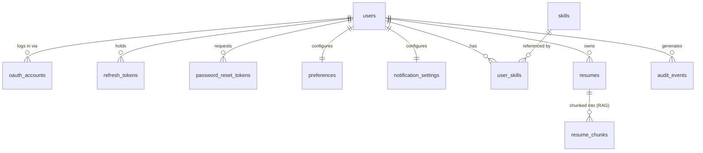
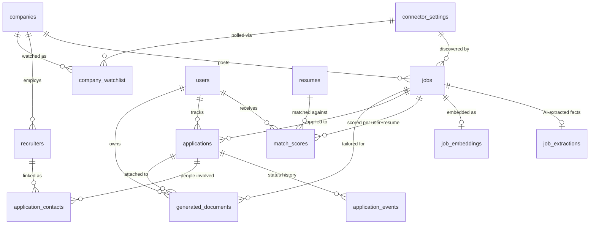
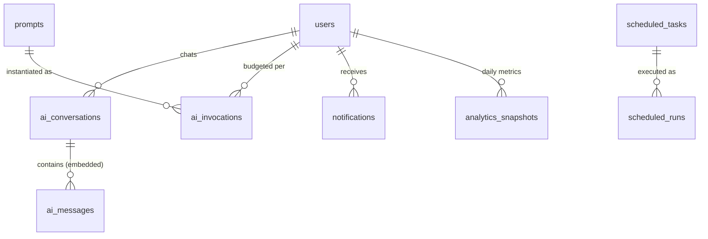

# JobPilot Platform — Database Design (Phase 2)

**Engine:** PostgreSQL 16 + `pgvector` + `citext` · **Canonical DDL:** [`db/schema.sql`](../db/schema.sql)
**Migrations:** the DDL becomes Alembic revision `0001` in Phase 4; all later changes are new revisions.
**Validated:** full DDL executed cleanly on PostgreSQL 15 (31 tables, 17 enum types, seed rows);
pgvector columns/HNSW indexes re-verified in CI with the `pgvector/pgvector:pg16` Testcontainer.

---

## 1. Design principles

- **Multi-tenant from day one.** Every user-owned row carries `user_id`; all
  service queries are user-scoped. Jobs and companies are *shared* (scraped
  once, matched per user) — per-user state lives in `match_scores` and
  `applications`, never on `jobs`.
- **Normalize what we query, JSONB what we archive.** Filterable attributes
  (employment type, salary, location, sponsorship) are typed columns with
  indexes; the connector's raw payload is kept in `jobs.raw` for reprocessing
  without re-scraping.
- **Enums for closed vocabularies** (11 application statuses, compliance
  modes, etc.) — typo-proof and self-documenting.
- **History is append-only.** Status changes (`application_events`), AI calls
  (`ai_invocations`), scheduler runs (`scheduled_runs`), and `audit_events`
  are immutable logs; `applications` uses soft delete so history survives.
- **Embeddings live next to the data.** `vector(768)` columns + HNSW cosine
  indexes on resume chunks, jobs, and assistant messages; `embedding_model`
  recorded per row so a model migration can re-embed incrementally.
- **UUID PKs** for user-facing entities (safe to expose in URLs), identity
  bigints for high-volume append-only logs.

## 2. Entity-relationship diagrams

### 2.1 Identity & profile

### 2.2 Jobs, matching & tracker (the core)

### 2.3 AI & operations

## 3. Table-group notes

| Group | Tables | Notes |
|---|---|---|
| Identity | `users`, `oauth_accounts`, `refresh_tokens`, `password_reset_tokens`, `audit_events` | `citext` email; refresh tokens hashed + rotation chain (`replaced_by`) for reuse detection; audit log is append-only with actor type (user/system/assistant) |
| Profile | `preferences`, `skills`, `user_skills`, `resumes`, `resume_chunks`, `notification_settings` | Preferences hold the full search filter set incl. `contract_arrangements` (W2/1099/C2C) and auto-apply policy (enabled, min score, daily cap); one default resume enforced by partial unique index |
| Catalog | `companies`, `recruiters`, `connector_settings`, `company_watchlist` | Companies dedupe on `normalized_name`; staffing firms = `is_staffing_firm` + watchlist rows (user-level or global `user_id IS NULL`); connector compliance mode lives in the DB so admin can see/toggle it |
| Jobs | `jobs`, `job_extractions`, `job_embeddings`, `match_scores` | `dedupe_hash` unique (canonical URL, else title+company); `first_seen/last_seen` drive trend analytics; extraction kept separate from the immutable posting; every match sub-score persisted so "why ranked low?" is answerable |
| Tracker | `applications`, `application_events`, `application_contacts`, `generated_documents` | 11-state enum matches the product spec exactly; `UNIQUE(user_id, job_id)` prevents double-tracking; events give full status history for funnel analytics |
| AI | `prompts`, `ai_invocations`, `ai_conversations`, `ai_messages` | Versioned prompts with one active version per key (partial unique index); invocation log powers cost/latency dashboards and per-user budgets |
| Ops | `notifications`, `scheduled_tasks`, `scheduled_runs`, `analytics_snapshots` | Schedules stored in DB (admin-editable, Celery beat reloads); snapshots make the dashboard O(1) reads |

## 4. Hot-path indexes

| Query | Index |
|---|---|
| "today's best matches" | `ix_match_scores_user_overall (user_id, overall DESC)` |
| active jobs by recency | partial `ix_jobs_posted (posted_at DESC) WHERE status='ACTIVE'` |
| tracker board | partial `ix_applications_user_status WHERE deleted_at IS NULL` |
| RAG retrieval | HNSW cosine on `resume_chunks`, `job_embeddings`, `ai_messages` |
| skill-based filtering | GIN on `job_extractions.skills` |
| title keyword search | GIN `to_tsvector('english', jobs.title)` |
| follow-up reminders | partial `ix_applications_next_action` |

## 5. Seed data

`schema.sql` seeds 16 connectors across the four compliance modes (Greenhouse,
Lever, Ashby, SmartRecruiters, Adzuna, Jooble, USAJOBS, Dice, Workday, careers
pages, JobSpy aggregation, four search-link builders, ATS auto-apply) and the
four production schedules: `ingest.full` 06:00 CT, `ingest.incremental` every
2h 08:00–18:00 CT, `report.daily` 21:00 CT, `analytics.weekly` Sun 18:00 CT.
